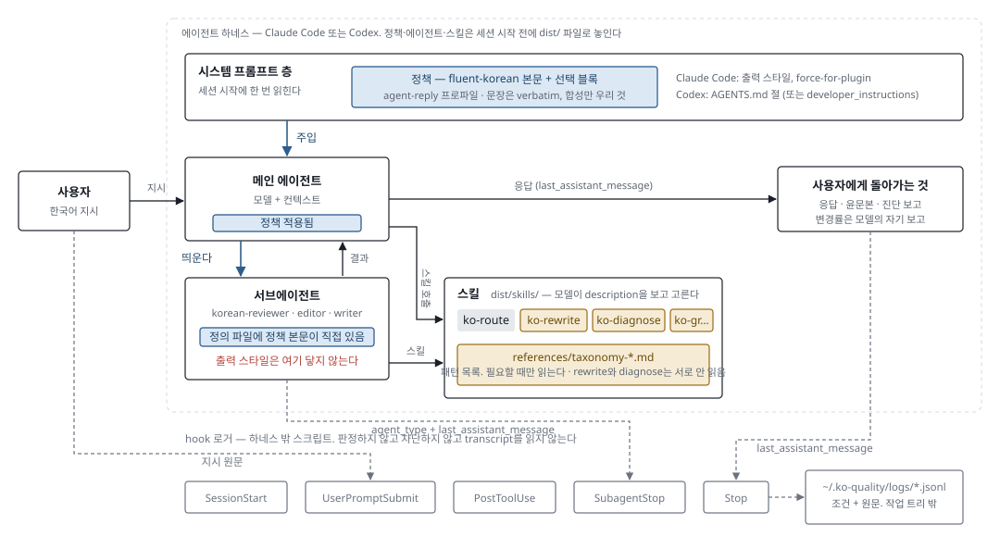
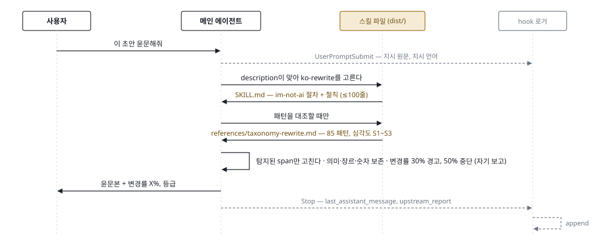
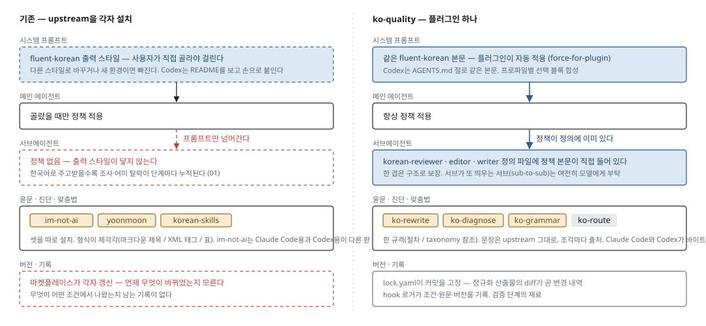

# ko-quality

코딩 에이전트의 한국어를 믿을 수 있게 만드는 툴킷입니다. 이미 있는 한국어 품질 upstream 넷([fluent-korean](https://github.com/snflkd/fluent-korean), [im-not-ai](https://github.com/epoko77-ai/im-not-ai), [yoonmoon](https://github.com/amondnet/yoonmoon), [korean-skills](https://github.com/DaleSeo/korean-skills))을 하나의 플러그인으로 묶어, 설치하면 사용자가 손대지 않아도 정책이 메인 대화와 서브에이전트 양쪽에 걸리고, 윤문·진단·맞춤법은 스킬로 부르며, 그 결과가 하네스 밖에 기록됩니다. Claude Code와 Codex를 대상으로 합니다.

> 시대 01(툴킷)이 지어져 `master`에 있습니다. Claude Code 쪽은 설치·정책 주입·스킬·서브에이전트·로거까지 실측으로 확인했고, Codex 쪽은 스킬과 메인 스레드 정책, 설치기까지 확인했습니다. Codex의 커스텀 에이전트 호출과 로거는 아직 확인하지 못했습니다(재시험은 미뤄 두었습니다). 아래 그림은 설계 스펙(06) 기준이라 지어진 결과와 다른 곳이 있습니다 — 플러그인은 프로파일마다 하나씩입니다. 진행 상태와 설계 기록은 [`design/README.md`](design/README.md)에 있습니다.

**원칙 둘.** upstream 문장은 그들의 것이고 형식만 우리의 것입니다. 문장을 고치지 않고 역할별 규격으로 정규화하며 출처를 답니다. 효과의 검증은 다음 단계의 일이고, 지금은 재료만 남깁니다.

## 설치

Claude Code 플러그인은 `ko-quality` 하나이고, 두 프로파일은 **고를 수 있는 출력 스타일**로 들어 있습니다. 설치만으로는 메인 대화에 정책이 걸리지 않고, **프로젝트마다 한 번 스타일을 고릅니다**(`/output-style ko-quality:agent-reply`).

| 프로파일 | Claude Code 스타일 | Codex 플러그인 | 정책 | 쓰임 |
|---|---|---|---|---|
| `agent-reply` | `ko-quality:agent-reply` | `ko-quality` | fluent-korean 코딩판 | 사용자에게 하는 간결한 코딩 답변 |
| `formal-report` | `ko-quality:formal-report` | `ko-quality-formal` | fluent-korean 비코딩판 + 존대 블록 | 사용자를 사용자님으로 부르는 높임말 |

- Claude Code: [`dist/claude-code/README.md`](dist/claude-code/README.md) — 로컬 마켓플레이스 등록, `claude plugin install`, 스타일 선택
- Codex: [`dist/agent-plugin/README.md`](dist/agent-plugin/README.md) — 플러그인 설치 후 `install/ko_quality_codex.py install` (정책 절과 에이전트 파일은 플러그인이 나르지 못합니다). 에이전트는 `multi_agent_v2`가 필요합니다

## 사용자가 할 수 있는 것

정책이 **생성에 스며들고**, 절차를 **스킬로 부르고**, 검토를 **서브에이전트에 위임**합니다.

| 방식 | 사용자가 하는 말 | 일어나는 일 | 읽히는 것 |
|---|---|---|---|
| 생성 주입 · 자동 | (아무 말도 안 함) | 플러그인이 켜져 있으면 fluent-korean 정책이 출력 스타일로 자동 적용됩니다. 보고문의 조사·어미가 살아나고 전보체가 사라집니다 | `output-styles/agent-reply.md` — 세션 시작에 한 번 |
| 스킬 호출 | "이 초안 윤문해줘" | 모델이 `ko-rewrite`의 description을 보고 스킬을 고릅니다. im-not-ai 절차와 철칙대로 탐지된 구간만 고치고 변경률을 보고합니다 | `skills/ko-rewrite/SKILL.md`, 필요할 때만 `references/taxonomy-rewrite.md` |
| 스킬 호출 | "AI가 쓴 티가 나는지 봐줘" | `ko-diagnose`가 yoonmoon detect 절차로 AI 가능성·신뢰도·근거를 보고합니다. 글은 고치지 않습니다 | `skills/ko-diagnose/SKILL.md`, `references/taxonomy-diagnose.md` |
| 스킬 호출 | "맞춤법이랑 띄어쓰기 봐줘" | `ko-grammar`가 korean-skills grammar-checker 절차를 따릅니다 | `skills/ko-grammar/SKILL.md` |
| 검토 위임 | "korean-reviewer로 검토시켜" | 정책 본문이 정의에 들어 있는 서브에이전트가 뜹니다. 진단만 하고 upstream 출력 형식 그대로 돌려줍니다 | `agents/korean-reviewer.md` — 정책 + ko-diagnose 절차 |
| 검토 위임 | "korean-editor로 고쳐서 줘" | 같은 방식의 서브에이전트가 rewrite → grammar 순서로 고칩니다. 프리셋 순서는 지시이지 강제가 아닙니다 | `agents/korean-editor.md`, 스킬 둘 |

## 하네스 안에서: 지시 하나가 만나는 파일들

정책은 세션 시작 전에 파일로 놓여 있어야 하고, 스킬은 모델이 고르며, 로거는 hook 입력만 받습니다. 세 층이 서로 다른 시점에 움직입니다.

<picture>
  <source media="(prefers-color-scheme: dark)" srcset="design/01-toolkit/3-spec/diagrams/flow-dark.svg">
  
</picture>

파랑 상자가 같은 정책 본문입니다. 시스템 프롬프트 층 하나로 서브에이전트까지 덮을 수 없으니(출력 스타일은 서브에이전트에 닿지 않음) 에이전트 정의 파일마다 같은 본문을 넣습니다. 스킬 본문은 절차와 철칙만 100줄 안에 두고, 패턴 목록은 참조 파일로 내려 모델이 필요할 때만 읽게 합니다. 로거는 모델이 모르는 곳에서 hook 입력만 모읍니다.

| 색 | 뜻 |
|---|---|
| 파랑 채움 | 우리가 조립해 주입하는 정책 (문장은 upstream 것) |
| 황토 채움 | upstream 문장 그대로 (출처 표시) |
| 붉은 점선 | 없거나 보장되지 않음 |
| 회색 점선 | hook 로거 — 모델은 모른다 |

## 한 턴을 따라가면: "이 초안 윤문해줘"

<picture>
  <source media="(prefers-color-scheme: dark)" srcset="design/01-toolkit/3-spec/diagrams/turn-dark.svg">
  
</picture>

스킬을 고르는 것도, 참조 파일을 읽을지도, 변경률을 세는 것도 모델입니다. 툴킷이 보장하는 것은 모델이 읽는 문장이 upstream의 것 그대로이고 그 출처와 버전이 기록된다는 점입니다. 변경률을 코드로 판정하는 gate는 검증 단계에서 더합니다.

## 기존과의 차이: 같은 세션, 두 구성

왼쪽은 오늘 upstream들을 각자 설치했을 때, 오른쪽은 ko-quality 하나를 설치했을 때입니다. 바뀌는 것은 문장이 아니라 **그 문장이 놓이는 자리와 개수**입니다.

<picture>
  <source media="(prefers-color-scheme: dark)" srcset="design/01-toolkit/3-spec/diagrams/compare-dark.svg">
  
</picture>

바뀌는 층은 둘입니다. 서브에이전트 층은 "정책 없음"에서 "정의에 정책 포함"으로, 버전·기록 층은 "각자 갱신, 기록 없음"에서 "lock 고정, hook 기록"으로. 정책 문장과 윤문 절차 자체는 양쪽이 같습니다. ko-quality는 그것을 고쳐 쓰지 않고 놓는 자리를 바꿉니다.

## 하네스별 주입 지점: 같은 본문, 다른 자리

| 층 | Claude Code | Codex |
|---|---|---|
| 메인 스레드 | `output-styles/<profile>.md`, `force-for-plugin: true` | `AGENTS.md` 절 (전역/프로젝트). 대안: `developer_instructions` |
| 서브에이전트 | `agents/<name>.md` 본문 | `.codex/agents/<name>.toml`의 `developer_instructions` |
| 스킬 | `skills/<name>/SKILL.md` — 양쪽 바이트 동일 | 같음 |
| 로거 | 플러그인 `hooks/hooks.json` | 플러그인 번들 (사용자 신뢰 검토 필요) |
| 보조 채널 | — | 없음 — tool 없는 MCP 서버는 싣지 않기로 했습니다 (P6·P7) |

## 보장하지 않는 것

- **효과는 아직 재지 않는다.** 정책을 넣으면 나아지는지는 검증 단계의 일이다. 지금 쌓이는 로그에는 대조군(policy off)이 없다.
- **변경률은 모델의 자기 보고다.** upstream의 Claude Code 경로는 스크립트로 판정하지만 06은 스크립트를 공급하지 않는다.
- **프리셋 순서는 권고다.** ko-route가 모델에게 지시할 뿐 실행 순서를 강제하지 못한다.
- **sub-to-sub는 구조로 보장되지 않는다.** 서브에이전트가 또 띄우는 에이전트에 정책을 넘기는 것은 여전히 모델의 몫이고, 로거도 그 경로를 가리지 못한다.
- **force-for-plugin은 먼저 로드된 플러그인이 이긴다.** 다른 강제 스타일 플러그인이 있으면 우리 정책이 밀릴 수 있다.
- **Codex에서 이름 붙은 서브에이전트 호출은 불안정하다.** 0.154.0 실측에서 위임 6회 중 1회만 `korean-reviewer`에 닿았고, 프로젝트 범위 에이전트는 도구로 제시되지 않았다. 정책 자체는 `AGENTS.md` 절로 메인과 서브에이전트에 닿는다.
- **Codex 로거는 아직 실측되지 않았다.** 레코드가 실제로 쌓이는지, hook 명령이 쓰는 `CLAUDE_PLUGIN_ROOT`가 Codex에서 설정되는지 확인하지 못했다(재시험은 미뤄 둠).

## 의존하는 upstream

문장은 전부 아래 네 프로젝트의 것입니다. ko-quality는 이들을 고정된 커밋에서 받아와 역할별 규격으로 정규화하고, 조각마다 출처를 답니다. 문장을 고치지 않고, 두 taxonomy를 한 컨텍스트에 올리지 않습니다.

| 프로젝트 | 역할 | 가져오는 것 | 라이선스 | 고정 커밋 |
|---|---|---|---|---|
| [snflkd/fluent-korean](https://github.com/snflkd/fluent-korean) | `policy` — 생성 시점 정책 | 출력 스타일 본문 2종(coding / not-coding)과 README의 선택 블록 7종 | MIT | `ce8683f` |
| [epoko77-ai/im-not-ai](https://github.com/epoko77-ai/im-not-ai) | `procedure.rewrite`, `taxonomy.rewrite` — 윤문 | 절차와 철칙, AI 티 분류 체계(10대 분류, upstream 85 패턴 중 생성기가 고른 61개) | MIT | `9747f03` |
| [amondnet/yoonmoon](https://github.com/amondnet/yoonmoon) | `procedure.diagnose`, `taxonomy.diagnose` — 진단 | detect 절차(수정 없이 신호 보고), 11대 분류 | MIT | `c888531` |
| [DaleSeo/korean-skills](https://github.com/DaleSeo/korean-skills) | `procedure.grammar` — 맞춤법·띄어쓰기 | grammar-checker 절차 | MIT | `ae12ba2` |

정확한 커밋·확인일은 [`upstream/lock.yaml`](upstream/lock.yaml)에 있습니다. 원본은 저장소에 커밋하지 않고(`upstream/.cache/`), 정규화 산출물(`upstream/normalized/`)만 커밋합니다. 검증 단계에서 결정론 규칙(`ruleset`) 공급자가 더해질 수 있습니다.

## 저장소

```text
ko-quality/
├── design/     설계 기록. 시대(era)별 → 7단계 일방향. 진행 상태는 design/README.md
├── upstream/   그들의 것. lock.yaml, normalized/ (커밋), .cache/ (커밋 안 함)
├── assemble/   우리의 것. 프로파일·프리셋·에이전트·스킬 템플릿
├── build/ dist/  만들어진 것
├── server/ logger/
├── AGENTS.md   에이전트 규칙. 상태 없음. Codex는 직접, Claude Code는 CLAUDE.md의 import로 읽음
└── CLAUDE.md   `@AGENTS.md` 한 줄
```

같은 그림을 한 페이지로 본 것: [`design/01-toolkit/3-spec/prompt-flow.html`](design/01-toolkit/3-spec/prompt-flow.html).

## 라이선스

MIT. upstream 넷도 모두 MIT이고, 정규화된 조각마다 출처(저장소·커밋·경로·해시)를 답니다. [`LICENSE`](LICENSE), [`upstream/lock.yaml`](upstream/lock.yaml).
